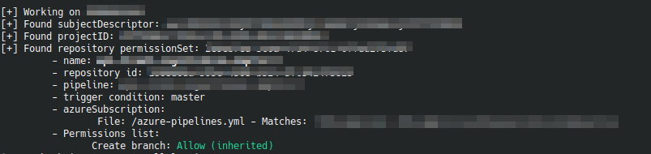

# Hiado
    __  ___           __    
   / / / (_)___ _____/ /___ 
  / /_/ / / __ `/ __  / __ \
 / __  / / /_/ / /_/ / /_/ /
/_/ /_/_/\__,_/\__,_/\____/ 

**Cross-projects Repository permissions enumeration Tool for Azure DevOps**

## What does Hiado do? 

Hiado is a python script that helps you enumerate information about the repositories your organziation manages within Azure DevOps. Particular focus is given to the enumeration of the permissions a specific user has, these can be: 

* Bypass policies when completing pull requests
* Bypass policies when pushing
* Contribute
* Contribute to pull requests
* Create branch
* Create tag
* Delete or disable repository
* Edit policies
* Force push 
* Manage permissions
* Read
* Remove others lock
* Rename repository

Hiado also supports extra checks/filter:
* the repository is used by a given pipeline
* enumeration of the "trigger" and "azureSubscription" parameters. 
An example output is: 



## How does Hiado do this? 

Hiado makes use of some "undocumented" Azure DevOps APIs. These APIs are used by Azure DevOps web, hence after I spent some time proxying HTTP requests, I could figure a chain of calls that would give me the list of the permissions an authenticated user has on a specific repository: 

```
POST /{ORGANIZATION}/_apis/Contribution/HierarchyQuery HTTP/2
Host: dev.azure.com
Cookie: UserAuthentication=[...];
User-Agent: Mozilla/5.0 (Windows NT 10.0; Win64; x64; rv:122.0) Gecko/20100101 Firefox/122.0
Accept: application/json;api-version=5.0-preview.1;excludeUrls=true;enumsAsNumbers=true;msDateFormat=true;noArrayWrap=true
Accept-Language: en-US,en;q=0.5
Accept-Encoding: gzip, deflate, br
Content-Type: application/json
Origin: https://dev.azure.com

{"contributionIds":["ms.vss-admin-web.security-view-permissions-data-provider"],"dataProviderContext":{"properties":{"subjectDescriptor":"","permissionSetId":"","permissionSetToken":"repoV2//","accountName":""}}}}
```
## Usage

Before using Hiado please run: 

```
pip3 install -r requirements.txt
```
And take a look at the help: 

```
python3 hiado.py -h
usage: hiado.py [-h] -org ORGANIZATION [-prj PROJECT] [-ct] [-csc] -ip INTERESTING_PERMISSION -ut USER_TOKEN

Azure DevOps Repository Attacking Tool

optional arguments:
  -h, --help            show this help message and exit
  -org ORGANIZATION, --organization ORGANIZATION
                        Organization name
  -prj PROJECT, --project PROJECT
                        Specify here the name of the project you want to check, all the others will be skipped
  -ct, --check-trigger  Print only results that have a trigger condition set (default: false)
  -csc, --check-service-connection
                        Print only results that have an azureSubscription set (default: false)
  -ip INTERESTING_PERMISSION, --interesting-permission INTERESTING_PERMISSION
                        Choose between: interesting,wide,full
  -ut USER_TOKEN, --user-token USER_TOKEN
                        User token
```

The permissions can be checked against three different lists (option -ip) defined as follow: 

```
full_permissions_list = [
    "Contribute",
    "Create branch",
    "Edit policies",
    "Manage permissions",
    "Bypass policies when pushing",
    "Bypass policies when completing pull requests",
    "Contribute to pull requests",
    "Create tag",
    "Delete or disable repository",
    "Force push (rewrite history, delete branches and tags)",
    "Manage notes",
    "Read",
    "Remove others' locks",
    "Rename repository",
]

interesting_permissions_list_wide = [
    "Contribute",
    "Create branch",
    "Edit policies",
    "Manage permissions",
    "Bypass policies when pushing",
]

interesting_permissions_list = [
	"Contribute", 
	"Create branch", 
	"Manage permissions"
]
```

Be sure you use a valid UserAuthentication cookie, you can find it in your browser after you have successfully authenticated. Unfortunately the "undocumented" APIs do not support authentication via PAT (personal access token)

## Credits

Credits to _bomber_ colleagues [Cas Van Cooten](https://twitter.com/chvancooten) and [Sander Maas](https://twitter.com/__Retrospect) who came up with great attack paths this tool is based on. 